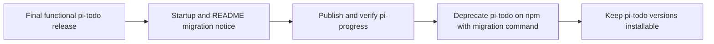

# Migrate pi-todo to pi-progress

## Goal

Replace `@narumitw/pi-todo` with `@narumitw/pi-progress`, expose only the model tool `update_progress`, and make the canonical tool payload and result state:

```json
{
  "steps": [
    {
      "text": "Inspect the current implementation",
      "status": "completed"
    },
    {
      "text": "Verify behavior with focused tests",
      "status": "in_progress"
    },
    {
      "text": "Publish the package",
      "status": "blocked",
      "reason": "Waiting for approval"
    }
  ]
}
```

Preserve valid branch-local progress from sessions created by `update_todo_list` and `todo_widget`, preserve cache-stable compaction boundaries across an extension upgrade, and provide a non-destructive settings fallback from `pi-todo.json` to the canonical `pi-progress.json`.

Roll out the replacement in two releases: first publish one final, fully functional `pi-todo` version that announces the migration without changing its tool contract; then rename and publish `pi-progress`, verify it from npm, and deprecate the old npm package with exact migration commands while leaving every old version installable.

## Context

`packages/pi-todo` currently registers `update_todo_list` with `{ todos: [{ step, status, reason? }] }`, stores version 3 details in tool results, reconstructs versions 1 through 3 from the active branch, restores compacted state through a hidden context message and branch-local boundary entry, renders an adaptive widget above the editor, and reads optional settings from `pi-todo.json`.

The rename changes three public identities at once:

- npm package and repository path: `@narumitw/pi-todo` / `packages/pi-todo` to `@narumitw/pi-progress` / `packages/pi-progress`;
- model tool contract: `update_todo_list` with `todos[].step` to `update_progress` with `steps[].text`; and
- user settings path: `pi-todo.json` to `pi-progress.json`.

The npm registry returned `404` for `@narumitw/pi-progress` on 2026-09-20, so this is a first publication rather than an npm rename. Pi identifies installed npm packages by package name and will not automatically replace the old package. Users must remove `@narumitw/pi-todo` and install `@narumitw/pi-progress`; installing both would expose two independent tools and widgets.

Existing installations cannot receive a push notification. The final `pi-todo` release therefore remains functional and adds a constant TUI/RPC startup warning, README notice, package description, changelog entry, and GitHub release note. The warning must tell users to confirm `@narumitw/pi-progress` is available, then preserve their installation scope: omit `-l` for user settings or pass `-l` to both remove and install commands for project settings. npm deprecation follows only after the replacement resolves from the registry, covering later installs and updates; users who never update can be reached only through repository and release announcements.

The user approved this staged notification, first-publication, and post-verification npm-deprecation strategy on 2026-09-20. Execution remains conditional on the plan's checks and does not authorize unpublishing, changing visibility, creating tags outside the normal release workflow, or removing historical releases.

Applicable touched-area rules and verification methods:

- **Package identity and runtime — MUST:** keep one default-export extension entrypoint, list the renamed source entrypoint in the root Pi manifest, keep generated `dist/index.ts` self-contained with package imports external, align published files with the manifest, and keep the package independently installable. **Verification:** `npm run check:boundaries`, generated-runtime tests, dry-run pack inspection, and a package-directory Pi load smoke.
- **Tool and branch state — MUST:** throw observable validation failures, honor cancellation, persist fork-sensitive state in tool-result `details`, and rebuild only valid state from the active branch. **Verification:** schema, validation, cancellation, restart, fork, tree-navigation, clear, and malformed-history tests.
- **Prompt and context transition — MUST:** treat the renamed tool definition and prompt guidance as one intentional prefix-epoch transition; preserve ordinary request prefixes thereafter; keep context reconciliation deterministic and idempotent; preserve an established old restored boundary byte-for-byte until its summary epoch ends. **Verification:** normalized provider-facing cache-contract tests covering upgrade, ordinary turns, update, clear, reload, branch navigation, and a later summary epoch.
- **Lifecycle and widget — MUST:** key the widget by the renamed package identity, clear the exact key on replacement and shutdown, cancel the completion timer and settings load on stale sessions, sanitize untrusted text, and keep every rendered line within width with the required separator. **Verification:** lifecycle, stale-continuation, completion-summary, hostile-text, narrow-width, zero-width, and non-TUI tests plus review after every `await`.
- **Settings — MUST:** use `getAgentDir()`, prefer the canonical package-matched filename, keep missing-file reads side-effect free, reject unsafe or invalid files without overwriting them, and reload on `session_start`. **Verification:** canonical/legacy precedence, missing, malformed, invalid, oversized, non-regular, symlink, UTF-8, cancellation, reload, and no-write tests.
- **README and release — MUST:** retain the required README structure and warnings, add a Changeset for each published behavior stage, run both repository gates, publish the final predecessor release through the normal release workflow, and use the approved first-publication and npm-deprecation actions only after their registry gates pass. **Verification:** README review and heading audit, Changesets status, registry visibility checks before and after each action, pack inspection, recorded approval, and release evidence.

## Architecture

```mermaid
flowchart LR
    A[update_progress call] --> B[Validate steps and statuses]
    B --> C[Canonical ProgressStep state]
    C --> D[Version 4 tool-result details]
    C --> E[Progress widget]
    C --> F{Current state still visible?}
    F -- yes --> G[Keep ordinary context unchanged]
    F -- no, after summary --> H[Insert one canonical hidden progress message]

    I[Historical branch entries] --> J{Recognized tool and version?}
    J -- update_todo_list v2/v3 --> K[Migrate todos[].step]
    J -- todo_widget v1 --> L[Migrate items[].text]
    K --> C
    L --> C

    M[pi-progress.json] --> N[Settings loader]
    O[pi-todo.json] -->|only when canonical is absent| N
```



The final predecessor warning is user-visible only: it must not alter the old tool definition, prompt guidance, session details, widget output, or model context. Guard `ctx.ui.notify()` with `ctx.hasUI`; do not print ad hoc output in print or JSON mode, add a postinstall script, make a network request, or write notification state.

The canonical runtime model will be `ProgressStep { text, status, reason? }` and `ProgressDetails { version: 4, steps }`. Keep `pending`, `in_progress`, `completed`, and `blocked`, the existing limits, the single-`in_progress` invariant, and the blocked-reason rule unchanged.

`progress-widget.ts` will own extension registration, session lifecycle, tool execution, timers, and widget publication. If the compatibility additions would push that module over 1,000 lines or obscure lifecycle review, move schema validation, historical decoding, equality, and context serialization into a focused `progress-state.ts`; do not split solely to rename files.

The compatibility decoder will recognize only these persisted contracts:

| Tool name | State version | Stored shape | Purpose |
| --- | ---: | --- | --- |
| `update_progress` | 4 | `{ steps: [{ text, status, reason? }] }` | Canonical writes and reads |
| `update_todo_list` | 3 | `{ todos: [{ step, status, reason? }] }` | Current predecessor sessions |
| `update_todo_list` or `todo_widget` | 2 | `{ todos: [{ step, status }] }` | Earlier predecessor sessions |
| `update_todo_list` or `todo_widget` | 1 | `{ items: [{ text, status }] }` | Legacy predecessor sessions |

Register only `update_progress`. Historical tool names are read-only migration inputs and must not remain active aliases. New tool calls, results, hidden context, custom message types, restored-boundary entries, widget keys, labels, and user-facing output use Progress terminology. Historical context message types, prefixes, and boundary entry types remain accepted only to restore existing sessions and preserve an already-established summary boundary.

Use `pi-progress.json` as the canonical settings path. To preserve the extension's existing no-write privacy contract, do not copy, rewrite, or delete `pi-todo.json`: when the canonical file is absent, read the legacy file through the same bounded, no-symlink validator; when both exist, use the canonical file; when the canonical file exists but is invalid, warn and use defaults rather than silently falling back. Document this intentional read-only filename-migration behavior.

## Non-Goals

- Do not change statuses, item limits, completion timing, adaptive layout, branch semantics, or non-TUI behavior beyond Progress terminology.
- Do not infer progress automatically or add percentage progress, nested steps, IDs, dependencies, commands, or a manual editor.
- Do not register `update_todo_list` or `todo_widget` as compatibility aliases.
- Do not coordinate with the old extension at runtime or add an extension-to-extension dependency.
- Do not mutate Pi's package settings, automatically uninstall the old npm package, or automatically install the new one.
- Do not overwrite, move, or delete `pi-todo.json`.
- Do not unpublish `@narumitw/pi-todo`, remove historical versions, add install scripts, or automatically redirect package installation.
- Do not execute the approved first publication or deprecation before all preceding release and registry gates pass; do not create extra tags or dispatch workflows outside the repository's normal release process.

## Risks

- Users who install both npm packages will receive duplicate progress policies and widgets; migration instructions must require removing the old package before installing the new one.
- Removing historical decoders too early would lose branch-local state after reload, resume, compaction, or tree navigation.
- Rewriting an old hidden boundary during its current summary epoch would invalidate the provider cache prefix; compatibility tests must assert exact retained content, not only equivalent state.
- Broadly accepting any object containing `steps`, `todos`, or `items` could reconstruct unrelated or malformed tool results; decoding must require a recognized tool name, successful result, exact version, valid shape, limits, and invariants.
- Falling back from an invalid canonical settings file to a valid legacy file would hide a user error and violate canonical precedence.
- The baseline `pi-todo` 0.3.3 release consumed `fast-ts-runtime-graphs.md`; the remaining migration-notice Changeset must be published before the path rename so no pending Changeset references the removed workspace.
- The final warning can briefly precede replacement availability; it must tell users to verify the new package exists before removing the old one, and the two release stages should be completed close together.
- First publication and normal Changesets release automation require deliberate sequencing because `@narumitw/pi-progress` does not yet exist in npm.

## Plan

### Stage 1: notify predecessor users without breaking them

- [x] Add a constant migration notice to the existing `pi-todo` README, package description, and `session_start` lifecycle while preserving `update_todo_list`, its prompt metadata, schema, details, widget, and model context unchanged; use the Changeset below as the source for the generated changelog and GitHub release note. Show the notice through `ctx.ui.notify()` only when `ctx.hasUI`; include `npm view @narumitw/pi-progress version` as the availability check and scope-matched user and project migration commands. Evidence: `packages/pi-todo/src/todo-widget.ts`, `package.json`, and `README.md`; focused package tests cover both command variants and the normalized cache contract.
- [x] Add focused predecessor-notice tests for startup, reload, replacement, shutdown, and non-interactive modes without persisting notice state or starting network/file work. Evidence: `todo-widget.test.ts`, `todo-widget-enhancements.test.ts`, and the generated-runtime loader test cover TUI, RPC, print, JSON, stale settings completion, replacement, shutdown, and the built runtime; all 47 focused tests pass.
- [x] Add a patch Changeset for the final `@narumitw/pi-todo` notice release and update its README migration section with the duplicate-install warning, availability check, scope-matched remove/install order, restart instruction, session-state compatibility, and settings fallback promise. Evidence: `.changeset/announce-pi-progress-migration.md`; after the baseline 0.3.3 release consumed `fast-ts-runtime-graphs.md`, `npm exec changeset status --verbose` reports the remaining `@narumitw/pi-todo` migration-notice patch intent.
- [x] Run focused `pi-todo` tests, its build, `npm run check`, plain `npm test`, `npm run package:pack -- todo`, and a non-interactive package-directory Pi load; inspect the tarball and record the notice behavior in every supported mode. Evidence: package typecheck/build and 47 focused tests pass; `npm run check` passes; all 5,096 repository tests pass; the dry-run tarball contains the declared nine files; `pi --no-extensions --no-skills -e ./packages/pi-todo --list-models` loads the package and lists 462 models; deterministic tests cover TUI, RPC, print, and JSON notice behavior.
- [ ] Publish the final predecessor version through the normal Changesets version PR and `publish.yml`, then verify npm serves the new `pi-todo` README, description, changelog/version, and functional tarball. Acceptance evidence: the published package still registers only `update_todo_list`, the release includes the migration notice, and the Changesets files consumed by that release no longer reference the soon-to-be-renamed workspace.

### Stage 2: implement and publish the replacement

- [ ] Record the replacement contract in focused tests before changing implementation: assert the sole registered tool is `update_progress`; its strict public schema is `{ steps: [{ text, status, reason? }] }`; only blocked steps accept `reason`; at most one step is `in_progress`; and empty `steps` clears state. Acceptance evidence: updated schema and validation tests fail against the predecessor implementation for the intended reasons.
- [ ] Rename `packages/pi-todo/` to `packages/pi-progress/`, update the package manifest to `@narumitw/pi-progress`, repository directory, description, keywords, source/test filenames, build-owned temporary prefixes, root `pi.extensions` entry, and workspace lockfile through root `npm install`. Acceptance evidence: `npm ls @narumitw/pi-progress` resolves the workspace, no active manifest or root entry references `@narumitw/pi-todo`, the final predecessor remains available from npm, and `npm run check:boundaries` passes.
- [ ] Rename the authoritative runtime vocabulary from Todo to Progress and adopt `ProgressStep.text`, `ProgressDetails.steps`, `update_progress`, label `Progress`, widget key `progress`, and Progress result/header/summary text without changing status behavior or limits. Acceptance evidence: focused tool, renderer, width, sanitization, completion-summary, non-TUI, and lifecycle tests pass and no new public payload contains `todos` or `step`.
- [ ] Introduce version 4 canonical details and hidden context serialization for `{ steps: [{ text, status, reason? }] }`, with new Progress-owned custom message and restored-boundary identifiers. Acceptance evidence: new calls persist only canonical version 4 details; restart, resume, clear, fork, and tree reconstruction recover the exact current list.
- [ ] Add strict historical decoding for `update_todo_list` versions 2 and 3 and `todo_widget` version 1, including valid tool-call arguments, successful result details, clears, blocked reasons, limits, and the single-active-step invariant. Acceptance evidence: table-driven tests cover every supported row plus wrong tool names, version/shape mismatches, errors, malformed entries, oversized text, multiple active steps, and stale earlier snapshots.
- [ ] Preserve old Todo hidden context and restored-boundary entries during their existing leading-summary epoch while deduplicating both old and new extension-owned custom messages; emit only canonical Progress context for a new summary epoch. Acceptance evidence: reload and branch-local tests prove old content remains byte-identical after a new update or clear in the same epoch, repeated reconciliation is idempotent, and a later epoch restores only current canonical Progress state.
- [ ] Update the normalized cache-contract suite for the intentional tool-definition and system-guidance transition: establish the first `update_progress` request as the new prefix baseline, then verify ordered active tools, provider-visible definition, effective guidance, and serialized message prefixes remain stable across ordinary turns, updates, clears, reloads, and compaction restoration. Acceptance evidence: exact-prefix assertions pass and exclude runtime-only metadata.
- [ ] Rename settings types and defaults to Progress terminology, make `pi-progress.json` canonical, and add read-only `pi-todo.json` fallback only when the canonical path is absent. Acceptance evidence: tests cover canonical-only, legacy-only, both-present canonical precedence, invalid canonical without fallback, invalid legacy, missing-both side-effect freedom, unsafe file types, UTF-8, bounds, cancellation, stale async completion, and zero filesystem writes.
- [ ] Update `README.md` under `packages/pi-progress` to the required structure and Progress terminology, including `update_progress`, the exact `steps[].text` example, canonical and legacy settings behavior, package build/load commands, old-package removal then new-package installation, session compatibility, duplicate-install warning, security/privacy, limitations, and package layout. Acceptance evidence: interfaces match implementation/tests, required headings and badges are present, the install warning remains, and the repository README heading audit passes.
- [ ] Preserve predecessor history in the renamed changelog and add a Changeset describing the new package/tool/schema contract and historical-session compatibility. Acceptance evidence: `npm exec changeset status --verbose` reports only existing workspaces and the replacement release intent; no Changeset references the removed workspace name.
- [ ] Audit the final diff against `docs/extension-conventions.md`, `docs/extension-settings.md`, and `docs/readme-conventions.md`: review cancellation and disposal, session replacement and shutdown, every post-`await` ownership check, state-decoder equivalence classes, prompt-prefix epochs, widget key cleanup, settings precedence/no-write behavior, package boundaries, and all user-visible names. Acceptance evidence: deviations are documented next to their owner and every applicable MUST has test, validator, review, or smoke evidence.
- [ ] Run the focused Progress tests, `npm --workspace @narumitw/pi-progress run build --if-present`, `npm run check`, and plain `npm test` sequentially. Acceptance evidence: all commands pass within the configured test timeout and the generated runtime has no missing or source-backward relative imports.
- [ ] Run `npm run package:pack -- progress`, inspect the tarball file list and manifest, then smoke `pi --no-extensions -e ./packages/pi-progress` after a clean package build. Acceptance evidence: the tarball contains only declared files, Pi's Jiti loader registers only `update_progress`, a representative call updates and clears widget key `progress`, and shutdown releases timers and UI.
- [ ] Recheck that `npm view @narumitw/pi-progress version` still returns `404`, publish the approved new scoped package once with `npm publish --workspace @narumitw/pi-progress --access public`, and verify npm serves the expected manifest, README, tarball, and installable Jiti runtime before proceeding. Acceptance evidence: registry metadata resolves the intended package/version and a clean temporary Pi scope loads only `update_progress`.
- [ ] After replacement verification, apply the approved npm deprecation message to `@narumitw/pi-todo@*` with the availability check and both scope-matched migration variants, then verify npm displays the warning while all old versions remain installable. Acceptance evidence: `npm view @narumitw/pi-todo deprecated` returns the intended message, `npm view @narumitw/pi-progress version` succeeds, and no unpublish or visibility change occurred.
- [ ] Prepare the final handoff with predecessor and replacement release evidence, registry status, migration commands, checks, smokes, semantic audits, and any unverified path. Acceptance evidence: later `pi-progress` versions are delegated to `publish.yml`, and any future removal or stronger deprecation action requires a new explicit decision.

## Rollback / Recovery

If replacement publication is delayed after the final predecessor notice ships, leave `pi-todo` functional, do not deprecate it, and update the notice in a normal patch if its availability guidance becomes inaccurate.

Before `pi-progress` publication, revert the package path, manifest/root entries, tool/schema names, settings path, compatibility additions, documentation, lockfile, and replacement Changeset as one change; rerun root `npm install`, `npm run check`, and `npm test`. Do not attempt to roll back the already-published predecessor notice; it remains a harmless functional release.

After first publication, do not unpublish either package. If the new package is defective, remove or narrow the npm deprecation message, keep `@narumitw/pi-todo` available, tell users to remove `@narumitw/pi-progress` and reinstall `@narumitw/pi-todo`, and publish a corrected `pi-progress` patch through the approved release path. Session state remains recoverable because the migration does not rewrite session files and both implementations retain their own historical tool-result data. The legacy settings file remains untouched.

## Completion Checklist

- [ ] A final functional `pi-todo` release notifies TUI/RPC users, documents the exact gated migration command, preserves the old tool/context contract, and is available from npm before the repository rename.
- [ ] The repository contains `packages/pi-progress` and no active `packages/pi-todo` workspace or root Pi entry after the predecessor release completes.
- [ ] The replacement registers only `update_progress` with the exact canonical `steps[].text` schema and writes only version 4 Progress details.
- [ ] Valid historical `update_todo_list` and `todo_widget` branches restore correctly; malformed or unrelated history never changes state.
- [ ] Old restored context remains byte-stable for its summary epoch, new epochs use canonical Progress context, and normalized ordinary-request prefixes remain stable after the intentional rename transition.
- [ ] The widget, timers, settings load, tree navigation, session replacement, non-TUI modes, and shutdown retain existing behavior under Progress-owned names.
- [ ] `pi-progress.json` wins when present, `pi-todo.json` is a read-only fallback only when canonical settings are absent, and neither file is modified.
- [ ] Both READMEs prevent duplicate installation and accurately describe availability checks, package/tool identities, payload, settings, privacy, limitations, historical-session support, and rollback commands.
- [ ] Package metadata, root manifest, lockfile, changelog, Changesets, generated runtime, tests, and both published tarballs agree with their release stage.
- [ ] Focused tests, package builds, `npm run check`, `npm test`, package pack inspections, and Pi Jiti load smokes pass with evidence in the handoff.
- [ ] npm resolves `@narumitw/pi-progress`, displays the approved `pi-todo` deprecation message, and retains every old package version; no package is unpublished and no visibility is changed.
