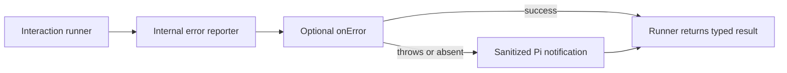

# Share Pi TUI Kit standalone error routing

## Goal

Use one package-internal implementation for common standalone-interaction error reporting while preserving each runner's lifecycle checks, typed outcomes, notification text, and terminal sanitization.

## Context

Confirmation, custom interaction, document review, live choice, multi-select, questionnaire, and task repeat the same policy: invoke optional `onError`, fall back when it throws, sanitize a notification, suppress notifier failures, and preserve the original typed result. Their stale and abort checks differ and must remain owned by each runner.

Applicable rules:

- Cancellation, disposal, session replacement, shutdown, and stale ownership **MUST** be audited for every asynchronous flow.
- Generation, context, ownership, and mutable state **MUST** be revalidated after each relevant `await`.
- Untrusted error text **MUST** be sanitized at the display boundary.
- `Ctrl+C`, configured cancellation, non-interactive behavior, and typed result distinctions **MUST** remain unchanged.

## Architecture

The helper owns only reporting mechanics. Each runner owns pre-report checks, post-`await` revalidation, and result construction.

## Non-Goals

- Do not create a generic lifecycle framework or merge the seven interaction runners.
- Do not normalize existing notification prefixes or sanitizers.
- Do not move stale, abort, disposal, or typed-result policy into callback configuration.
- Do not expose the reporter as public Pi TUI Kit API.

## Risks

- Moving an `await` across a stale check can report obsolete errors or change `error` to `stale` outcomes.
- A generic option object can obscure the small behavioral differences it is meant to preserve.
- Sanitizer changes can expose terminal controls or alter visible messages.

## Plan

- [x] Run the seven existing interaction suites and record a behavior matrix for callback timing, reporter failure, notifier fallback, UI eligibility, sanitizer, notification prefix, stale checks, abort checks, and typed result.
  Evidence: baseline `npx vitest run packages/pi-tui-kit/test/{confirmation,custom-interaction,document-review,live-choice,multi-select,questionnaire,task}.test.ts` passed 93 tests; matrix recorded in `packages/pi-tui-kit/docs/error-routing.md`.
- [x] Design one package-internal reporter limited to optional callback invocation, reporter-failure fallback, sanitized notification, and notifier-failure suppression; reject any API that owns runner lifecycle or result construction.
  Design: one internal module with separate callback and notification functions; runner-local eligibility checks remain between phases, with no lifecycle predicate or typed-result configuration.
- [x] Add focused table-driven reporter tests for callback success, callback rejection, notifier rejection, no UI, notification eligibility, hostile terminal text, and exact labels.
  Evidence: `interaction-error.test.ts` and `interaction-error-routing.test.ts` cover all seven runners, four modes, pending callbacks, original error identity, and synchronous Pi notifier failure (`notify` returns `void`).
- [x] Migrate confirmation and questionnaire first because they already wrap reporting with explicit before/after stale checks; verify no check moves across the callback `await`.
  Evidence: first migration plus reporter tests passed 269 tests and Kit typecheck.
- [x] Migrate document review, multi-select, and live choice while preserving each current sanitizer, prefix, signal check, and `isCurrent()` behavior.
  Evidence: middle migration plus routing matrix passed 255 tests.
- [x] Migrate custom interaction and task last, preserving their distinct result construction and current notification eligibility rather than forcing normalized semantics.
  Evidence: final focused run passed 397 tests, including cancellation and disposal during task error reporting.
- [x] Audit cancellation, disposal, session replacement, shutdown, stale state after every `await`, callback failure, notifier failure, and terminal sanitization against `docs/extension-conventions.md`.
  Evidence: full diff reviewed against the conventions' touched-area checklist and package AGENTS.md; no ownership predicate, signal/disposal/drain path, result construction, sanitizer, prefix, UI mode guard, public API, or dependency changed. The reporter owns no background resource. Matrix tests cover ownership changes during delayed callbacks and task cancellation/disposal.
- [x] Run `npx vitest run` for confirmation, custom interaction, document review, live choice, multi-select, questionnaire, task, and the new reporter tests; verify all tests pass within 5,000 ms.
- [x] Run the non-interactive rendering and non-default keybinding tests relevant to affected interactions.
  Evidence: 14 focused files / 397 tests passed with the unchanged 5,000 ms timeout, including interaction-hints, review-screen, document-search, package-exports, and smoke-fixture tests; tests cover RPC, print/JSON, remapped cancellation, Ctrl+C, editor/paste, and width bounds.
- [x] Build Pi TUI Kit, run `npm run check` and plain `npm test`, then inspect the final diff to confirm the helper remains internal and no public exports changed.
  Evidence: Kit build and root `npm run check` passed; plain `npm test` passed 446 files / 5,335 tests. Biome reported three existing informational diagnostics outside the diff. `npm run package:pack -- tui-kit` passed; an actual tarball was also extracted and every declared JS/declaration path verified, with the reporter present internally but absent from package exports. `npm run changeset:status` confirms the intended Kit patch.
- [x] Not applicable: the API reference requires a human-operated terminal and explicitly forbids a non-interactive subprocess for this smoke; this session cannot launch interactive tools. The deterministic smoke-fixture registration test passes. Real terminal input/mouse, resize, and `/reload` theme behavior remain unverified and will be recorded in the PR.

## Rollback / Recovery

No user data or public API is involved. If callback timing, stale outcomes, notification text, cancellation, or sanitization differs, restore the affected runner's local reporter rather than expanding the helper with lifecycle-specific branches. Revert the helper only after all migrated callers are restored.

## Completion Checklist

- [x] One internal helper owns only the common error-reporting mechanics.
- [x] Every runner retains local lifecycle checks and typed result construction.
- [x] Callback timing, exact prefixes, sanitizers, UI eligibility, stale outcomes, and cancellation match the baseline.
- [x] Reporter and all seven interaction suites pass.
- [x] Non-interactive and non-default-keybinding coverage remains green.
- [x] Root checks and tests pass with no public API change.
