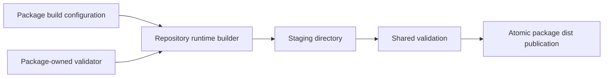

# Share generated-runtime build tooling

## Goal

Replace duplicated generated-runtime build machinery with one repository-owned implementation while preserving every package's generated paths, eager boundaries, externalization, validation, atomic publication, and standalone runtime behavior.

## Context

Twenty-nine packages have a local `scripts/build-runtime.mjs` and matching `test/build-runtime.test.ts`. Most repeat staging, esbuild invocation, eager-graph checks, path safety, generated-file validation, cleanup, and backup/rename publication. `test/runtime-builder-contract.ts` already captures the common contract, but only three packages register it.

This is repository tooling, not a published runtime dependency. Thin package wrappers must retain package-specific entrypoints, forbidden eager inputs, externals, temporary-directory names, and focused validators.

Applicable rules:

- Generated static and dynamic relative imports **MUST** resolve to exact emitted paths.
- Pi-bundled peer dependencies **MUST** remain externalized.
- Package runtimes **MUST** remain independently installable and loadable through Pi's Jiti runtime.
- Publication **MUST** reject destructive paths and symlink escapes and restore prior output after validation or rename failure.
- Package-specific lazy, lifecycle, source-graph, and generated-entry tests **MUST** remain local.

## Architecture

The shared builder may call explicit package-owned validators. It must not inspect package names or contain extension-specific branches.

## Non-Goals

- Do not publish the builder as a runtime library.
- Do not force an outlier package into the shared engine if doing so requires speculative hooks or package-name branches.
- Do not change runtime entrypoints, output filenames, bundle splitting, import style, or lazy-loading policy.
- Do not remove package-specific Jiti or lifecycle tests.

## Unknowns

- Which differences in `pi-sync`, `pi-subagents`, `pi-langfuse`, `pi-starship`, and `pi-ticker` are declarative configuration versus package-owned validation.
- Whether every package can migrate without making the shared API more complex than the duplicated implementation it replaces.

## Risks

- One builder defect can affect every generated runtime.
- A configurable mini-framework would increase rather than reduce cognitive complexity.
- Output can appear valid to TypeScript while failing under Pi's Jiti loader or at a lazy import boundary.

## Plan

- [x] Record a clean baseline for all 29 packages; capture temporary generated-file inventories, relative imports, eager inputs, externals, and output hashes, run current builder tests, and verify `git status --short` is clean.
  Evidence: base `130ded9e`; all workspace builds and 29 builder files / 158 tests pass; temporary inventories, parsed imports, normalized metafiles, eager graphs, and SHA-256 hashes were captured and compared; worktree was clean after capture.
- [x] Enumerate every local builder difference and classify it as shared policy, declarative configuration, package-owned validation, or a reason not to migrate; include the resulting table in the implementation handoff.
  Evidence: `docs/runtime-builder.md` classifies all 29; Langfuse retains its dual-graph/declaration pipeline.
- [x] Design the smallest repository-owned builder API that covers only confirmed shared policy; verify it has no package-name checks, extension-specific branches, unused options, or callbacks that merely recreate local builders.
- [x] Implement common staging, esbuild execution, eager-graph checks, generated-file checks, output-path safety, cleanup, and atomic publication under `scripts/`.
- [x] Adapt `test/runtime-builder-contract.ts` to exercise the shared engine and wrapper contract, including destructive output, symlink escape, bundled dependencies, eager dependencies, stale output, failed validation, failed publication, and restoration of prior output.
  Evidence: 28 wrapper registrations plus direct engine tests for parser validation, cleanup, all rename-failure stages, retained recovery backup, and symlink revalidation.
- [x] Convert simple packages to thin wrappers in small groups; after each group, compare generated inventories, imports, eager inputs, externals, and hashes with the baseline before continuing.
  Evidence: groups of 8, 7, 8, and 5 have exact inventory, parsed imports, normalized metafile/eager graph and SHA-256 equality.
- [x] Convert packages with multiple entries or specialized validation only when the variation audit proves a simple configuration or focused package-owned validator; otherwise leave the package local and document why.
- [x] Register the common contract in every migrated package and remove only duplicated generic cases; retain package-specific generated-entry, lazy-boundary, source-graph, lifecycle, and Jiti tests.
- [x] Audit generated static and dynamic imports, exact output paths, externalized Pi dependencies, lazy activation, stale-output removal, and rollback semantics against `docs/extension-conventions.md`.
  Evidence: full variation/diff review, exact generated graph/hash comparisons, 34 unchanged package-specific test ASTs, root failure matrix and package Jiti tests; documented validation hardening leaves emitted output unchanged.
- [x] Run every runtime-builder test and build every migrated workspace; verify all tests stay within the configured 5,000 ms limit and no tracked generated files change unexpectedly.
  Evidence: 30 focused files / 204 tests pass with the unchanged 5,000 ms limit; root check and plain npm test rebuild every workspace; no generated files are tracked changes.
- [x] Run `npm run typecheck`, `npm run check`, and plain `npm test`; verify workspace builds, Biome, boundaries, typechecks, active root tests, and workspace tests pass.
  Evidence: all gates pass; plain npm test reports 445 files / 5,147 tests. Expected diagnostics come from deliberate invalid-build/require fixtures.
- [x] Smoke every migrated package with `pi --no-extensions --no-skills -e ./packages/pi-<name> --list-models`; additionally exercise representative simple, lazy, multi-entry, and specialized-validator boundaries through Pi's Jiti loader.
  Evidence: all 28 explicit workspace builds and isolated CLI loads pass; package Jiti tests cover analytics, stamp, ticker, sync, subagents and starship boundaries; all 28 pack dry runs include every generated file and license without build scripts.
- [x] Review the final diff for one repository builder, thin wrappers, and focused exceptions; record migrated packages, retained outliers, output-comparison evidence, tests, and smokes in the handoff.
  Evidence: `docs/runtime-builder.md` records the audit, 250 unchanged generated files, inventory digest, checks, smokes and Linux-only verification limits.

## Rollback / Recovery

No user data or settings are involved. Keep the builder and wrapper migration in focused commits. If one package cannot prove output and loader equivalence, restore its local builder and tests rather than adding package-specific complexity. If the common engine fails broadly, revert the engine, wrappers, and generated outputs together.

## Completion Checklist

- [x] Every local builder is classified, and each retained outlier has an evidence-based reason.
- [x] The shared builder contains no package-specific branch or speculative extension point.
- [x] Every migrated wrapper declares only package-owned configuration and validation.
- [x] Generated paths, imports, eager boundaries, externalization, validation, cleanup, and publication match the baseline.
- [x] Generic contract tests are shared while package-specific tests remain local.
- [x] All migrated builds and Pi loader smokes pass.
- [x] `npm run typecheck`, `npm run check`, and `npm test` pass.
- [x] No temporary baseline artifacts or unrelated changes remain.
  Evidence: temporary snapshots and logs removed after recording the inventory digest and results in `docs/runtime-builder.md`; only intended builder, test, documentation and plan changes remain.
