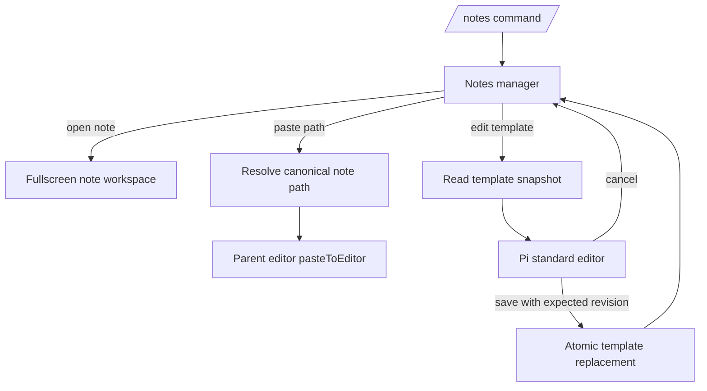

# Pi Notes quick wins plan

## Goal

Deliver the low-risk `/notes` improvements first: simplify the workspace title, paste an existing note's canonical absolute path into the parent editor without replacing its draft, and edit existing templates with stale-write protection.

## Context

- `packages/pi-notes/src/workspace.ts` currently renders `Pi Notes · <notePath>`; only the fullscreen workspace title changes, while the manager title remains unchanged.
- `packages/pi-notes/src/menu.ts` currently opens a selected note immediately and uses the template list only during note creation.
- `packages/pi-notes/src/notes-extension.ts` already owns session generation, cancellation, and the handoff from the manager to the workspace.
- `packages/pi-notes/src/storage.ts` already enforces managed-root containment, rejects symlinks, serializes writes with `withFileMutationQueue()`, checks revisions, and publishes replacements atomically.
- Pi publicly provides `ctx.ui.pasteToEditor(text)` and `ctx.ui.editor(title, prefill)`; the manager must close before either parent-UI action runs.
- The manifests and lockfile target Pi `0.86.0`, while the current installed tree reports `0.85.1`; verification starts by restoring the locked dependency tree.

### Applicable rules and verification

- **Storage mutations:** preserve path normalization, canonical containment, symlink rejection, bounded Markdown, mutation queues, revision checks, and atomic publication. Verify with **Test** and write-path **Review**.
- **Commands and menus:** retain `/notes` with no arguments, its TUI-only guard, and deterministic rejection in print, JSON, and RPC modes. Verify with **Test** and interface **Review**.
- **Lifecycle:** revalidate signal, session manager, and generation after every asynchronous boundary; stale sessions must not paste, save, notify, reopen the manager, or launch a workspace. Verify with delayed-flow **Test** and callback **Review**.
- **TUI:** continue using `@narumitw/pi-tui-kit` for the manager and Pi's standard editor for template content; sanitize paths at display boundaries and preserve raw file identities and content. Verify with rendering/cancellation **Test** and TUI-contract **Review**.
- **Documentation and release:** keep the README aligned with implementation and update the existing pending Pi Notes Changeset. Verify with README **Review**, `npm run changeset:status`, package **Smoke**, `npm run check`, and `npm test`.
- No settings, package entrypoint, dependency, or model-visible prompt changes are planned, so `docs/extension-settings.md`, settings migration, and prompt-cache verification are not applicable.

## Architecture

The manager remains the only selector. It returns explicit outcomes, then closes before the command performs parent-editor or template-editor work.

Use a discriminated manager result instead of optional fields:

- `{ kind: "open", notePath }`
- `{ kind: "pastePath", notePath }`
- `{ kind: "editTemplate", templatePath }`
- `{ kind: "closed" }`

Preserve one-step note opening. Add separate top-level **Paste a note path…** and **Manage templates…** routes rather than forcing every note through an additional action screen.

## Non-Goals

- Delete or rename notes and migrate or remove their child-session history.
- Replace the side-thread transcript with Pi main-session message components.
- Read or attach clipboard images.
- Create, rename, or delete templates, or give templates an agent-assisted workspace.
- Add command arguments, settings, dependencies, or package entrypoints.

## Risks

- `ctx.ui.editor()` is Pi-owned and has no extension-supplied abort signal; every continuation after it returns must reject stale ownership, and session replacement while it is open needs deterministic coverage plus a local smoke.
- A template can change outside Pi while its editor is open; the save must reject the stale revision and preserve the external content.
- A selected note can disappear or be replaced before path insertion; resolve it again through storage immediately before pasting.
- New manager routes can accidentally regress direct note opening or note-creation navigation; retain explicit regression tests for both paths.

## Rollback / Recovery

- Title and path-paste operations do not mutate managed files.
- Template cancellation, stale revisions, failed publication, and session replacement leave the prior template content intact; temporary files are removed by the existing atomic-write recovery path.
- There is no data migration. Reverting the package restores the prior UI, while templates that users intentionally saved remain ordinary Markdown files.

## Plan

- [x] Restore the locked dependency tree with `npm install`, producing no manifest or lockfile drift; verified `npm ls @earendil-works/pi-coding-agent @earendil-works/pi-tui` resolves the repository's `0.86.0` versions without invalid entries.
- [x] Simplify the title in `packages/pi-notes/src/workspace.ts` to the sanitized relative note path without the `Pi Notes ·` prefix; focused workspace tests pass for exact wide, narrow, and constrained titles, width bounds, input behavior, and disposal.
- [x] Add a canonical absolute-note-path resolver to `packages/pi-notes/src/storage.ts`, reusing existing normalization, containment, and symlink checks; focused storage tests pass for exact canonical output plus missing-file, traversal, special-file, and symlink rejection.
- [x] Add a dedicated path-paste picker and `{ kind: "pastePath", notePath }` outcome in `packages/pi-notes/src/menu.ts`, then handle it in `packages/pi-notes/src/notes-extension.ts` only after the manager closes and ownership is revalidated; focused command tests pass for direct opening, creation, exact draft-preserving insertion, no thinking/workspace launch, cancellation, disappearance, and replaced-session rejection.
- [x] Add template snapshots and expected-revision replacement to `packages/pi-notes/src/storage.ts`, reusing bounded reads, the template-root mutation queue, and atomic replacement; focused storage tests pass for exact content, stale/concurrent rejection, cancellation, failed publication recovery, symlink/traversal rejection, and temporary-file cleanup.
- [x] Add the **Manage templates…** route and `{ kind: "editTemplate", templatePath }` outcome in `packages/pi-notes/src/menu.ts`, then loop in `packages/pi-notes/src/notes-extension.ts` through `ctx.ui.editor()` and revision-safe save; focused command tests pass for empty/rescanned lists, raw identity and sanitized labels, cancel/unchanged/stale saves, refreshed state, and stale lifecycle continuations.
- [x] Update `packages/pi-notes/README.md` to document path insertion, existing-template editing, cancellation/stale-write behavior, and the remaining template limitations, then amend `.changeset/public-pi-notes.md` so the pending release summary includes these user-visible behaviors; the fenced-code-aware audit passed all 36 package READMEs, and the Pi Notes warnings, commands, Mermaid flow, limitations, and implementation claims match `docs/readme-conventions.md`.
- [x] Audit the final diff against `docs/extension-conventions.md`: every changed asynchronous boundary rechecks its signal or session ownership before mutable UI or file work; template publication reuses canonical containment, the template-root mutation queue, bounded reads, revision checks, same-directory temporary files, atomic rename, and cleanup; manager/editor cancellation, replacement, shutdown, raw identity, display sanitization, and every new manager transition have focused coverage. No semantic deviation was found.
- [ ] Run focused tests for Pi Notes, then run `npm run check`, `npm test`, and `npm run changeset:status`; the 65 focused tests, `npm run check`, and Changesets status pass without generated drift or timeout changes, but the supported-Node-22 full run finishes with 5,503 of 5,506 tests passing. One unrelated `pi-sync` timeout passed on focused rerun; the remaining `pi-github-pr` aborted-signal assertion and `pi-subagents` asynchronous-stdin timeout reproduce unchanged in an external clean worktree at `origin/main` (`6b08af8d`), so this required gate remains open rather than expanding this plan into unrelated packages.
- [x] Run `npm run package:pack -- notes`, inspect the tarball contents, and smoke `pi --no-extensions --no-skills -e ./packages/pi-notes`; the dry run and an actual temporary archive contain only the expected license, README, manifest, and source entrypoint files, while an offline explicit-package load and the Jiti loader test pass. The live TUI command and manual `/reload` interaction are impractical in this non-interactive execution environment; deterministic tests cover direct open, draft-preserving path paste, template save/cancel, post-editor session replacement, the simplified title, and repeated `session_start` as the reload boundary, leaving only terminal-specific visual interaction unverified.

## Completion Checklist

- [x] Existing notes still open directly and note creation still copies templates exactly once.
- [x] Path paste inserts the exact canonical absolute note path and preserves the parent draft.
- [x] Existing templates can be edited, while cancellation, stale revisions, failures, and replaced sessions cannot overwrite them.
- [x] The workspace title contains only the sanitized relative note path.
- [x] README and pending Changeset describe the shipped behavior and exclusions accurately.
- [x] Storage, menu, lifecycle, TUI, and documentation semantic audits have no unresolved findings.
- [ ] Focused tests, `npm run check`, `npm test`, Changesets status, package pack inspection, and the local Pi smoke have passing evidence or an explicitly accepted exception; the clean-base root-test failures and non-interactive live-TUI limitation are documented above but have not been accepted as passing gates.
