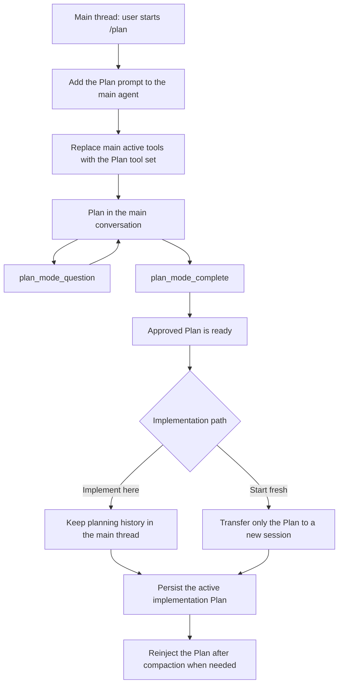
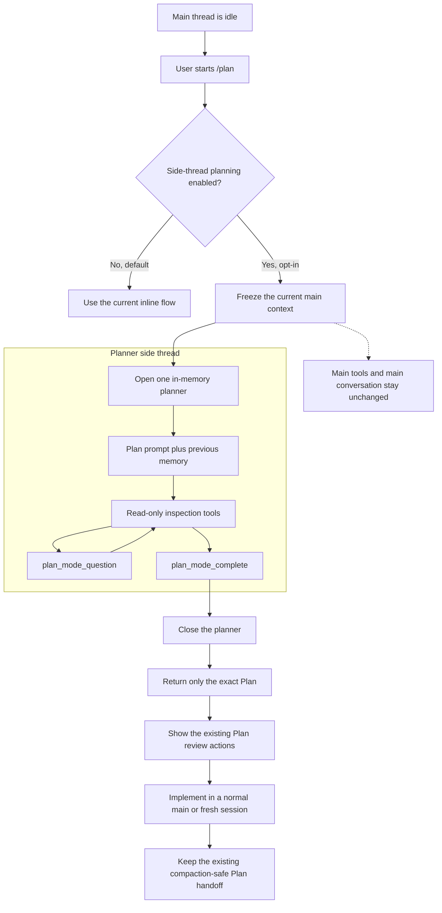

# Pi Plan Mode Side-Thread Roadmap

- **Status:** Proposed direction; not an implementation or release commitment.
- **Audience:** Maintainers and users of `pi-plan-mode`, `pi-goal`, and `pi-workflow`.

## Vision

Do planning in a temporary side thread so the main conversation stays clean.

The planner remembers the main conversation, but only the approved Plan returns to it.

Keep this feature inside `pi-plan-mode` without adding a workflow-engine package.

## Objectives

- **Clean main thread** — Side planning adds no Plan tools, planning messages, or planning tool results to the main model context.
- **Useful memory** — The planner starts from a compaction-aware snapshot of the current main branch.
- **Safe planning** — The planner can inspect the repository but cannot edit it.
- **Simple handoff** — Completion returns the exact approved Plan and nothing else.
- **Safe rollout** — Side-thread planning is disabled by default and requires a manual opt-in.
- **Proven coexistence** — Plan and Goal no longer replace each other's tools before any `pi-workflow` deprecation decision.

## Current State

- Plan mode itself is already off until the user starts it with `/plan`, `--plan`, or a configured shortcut.
- Planning currently happens in the main conversation.
- The main agent receives the Plan prompt, `plan_mode_question`, and `plan_mode_complete`.
- Plan mode replaces Pi's process-wide active-tool list with a restrictive planning list.
- Planning messages and tool results remain in the main session branch.
- **Implement here** keeps the planning history, while **Start fresh and implement** transfers only the approved Plan.
- During implementation, the approved Plan is persisted and injected again if compaction removes the original handoff.
- `pi-goal` also depends on Pi's process-wide active-tool list, so overlapping Plan and Goal activity can affect tool availability.
- `pi-btw` provides a useful side-thread experience, but its `streamSimple()` call has no tool loop.
- Pi's SDK appears to provide the child-session building blocks, but the full integration still needs proof.

## Current Flow

## Expected Flow

## Guiding Principles

- **Minimal first:** build one planner, not a general workflow engine or thread manager.
- **Opt in safely:** a missing, false, or invalid setting keeps the current inline behavior.
- **Snapshot, not shared memory:** the planner sees a frozen main context and cannot write back into it.
- **One-way return:** only a valid completed Plan crosses back to the main thread.
- **No hidden concurrency:** the main agent does not continue while the planner reads the working tree.
- **Reuse existing behavior:** keep the current review, save, export, implementation, and compaction handoff after completion.

## Roadmap

### Phase 1: Prove the smallest planner session

- [ ] One package-local prototype opens an in-memory child agent with the selected model, valid authentication, isolated resources, and no new package.
- [ ] The child receives a valid compaction-aware main-context snapshot and can run read-only tools plus the two Plan tools.
- [ ] Starting, cancelling, and closing the child leave the main context, active tools, editor, and persisted Plan state unchanged.
- [ ] If Pi's public SDK is insufficient, the missing capability is documented before choosing one small upstream Pi primitive instead of a local runtime framework.

**Outcome:** The child-session design is proven small enough to continue.

### Phase 2: Add a default-off experiment

- [ ] `pi-plan-mode` adds `sideThreadPlanning`, whose effective default is `false`.
- [ ] The inactive Settings screen shows **Plan in side thread: Off/On** and labels On as experimental.
- [ ] Users can enable the same behavior through `"sideThreadPlanning": true` in `pi-plan-mode.json`.
- [ ] The setting applies only to the next Plan workflow, and unsupported UI modes reject before changing state.
- [ ] Existing behavior and tests remain unchanged while the setting is absent or false.

**Outcome:** Interested users can opt in without changing the stable default.

### Phase 3: Complete the side-thread experience

- [ ] Starting waits for the main agent to become idle, captures one context snapshot, and blocks concurrent main-agent work until planning ends.
- [ ] The planner supports inspection, structured questions, multiple turns, completion, and hard cancellation without repository mutation.
- [ ] Completion closes the child only after capturing a valid Plan, while cancellation returns no partial Plan.
- [ ] The returned Plan uses the existing review, revision, save, export, and implementation actions.
- [ ] Replacement, reload, shutdown, stale callbacks, UI disposal, and model or authentication failure release every child-owned resource.

**Outcome:** Opted-in users can plan with prior memory while the main thread receives only the finished Plan.

### Phase 4: Prove coexistence and decide what follows

- [ ] Co-installation tests show that inactive `pi-plan-mode` and `pi-goal` do not change one another's tools, prompts, commands, or state.
- [ ] Side planning never replaces the main active-tool list, so it cannot remove Goal completion tools.
- [ ] Simultaneously active Plan and Goal workflows follow one explicit no-package interlock that prevents working-tree races.
- [ ] The interlock remains correct across Goal continuation, cancellation, replacement, reload, and shutdown.
- [ ] Evidence determines whether side planning stays experimental, becomes the default, or is removed.
- [ ] Any `pi-workflow` deprecation remains a separate decision that considers migration and the loss of atomic Plan-to-Goal behavior.

**Outcome:** Maintainers have evidence for later defaults and product cleanup without pre-approving either change.

## Success Measures

| Indicator | Required result |
| --- | --- |
| Side planning without explicit opt-in | Never active |
| Main active-tool changes during side planning | Zero |
| Plan tools visible to the main model during side planning | Zero |
| Planning transcript copied back to main | Zero |
| Completed Plan fidelity | Exact within the existing 50,000-character limit |
| Planner-caused repository mutations | Zero admitted mutations |
| Orphan child work after cancellation or lifecycle changes | Zero |
| Plan and Goal tool replacement during supported coexistence | Zero |

## Risks and Dependencies

| Risk | Response |
| --- | --- |
| Child-session setup becomes a second Pi runtime | Stop at Phase 1 and prefer one small upstream Pi API. |
| Context transfer breaks compaction or tool-call pairs | Use Pi's public reconstruction helpers and test compacted and forked branches. |
| The working tree changes while planning | Pause main-agent work and require an explicit Plan/Goal interlock. |
| A child question tool strands UI or promises | Use one lifecycle owner, one abort signal, and stale-generation checks after every await. |
| An in-progress in-memory Plan is lost on reload | Accept this as an explicit first-version limit or admit persistence in a later decision. |
| Keeping inline and side hosts causes drift | Share question, completion, validation, review, and handoff logic. |
| Removing `pi-workflow` loses atomic Plan-to-Goal behavior | Keep deprecation outside this roadmap's automatic outcomes. |

## Non-Goals

- Create `@narumitw/pi-workflow-engine` or another shared package.
- Make `pi-plan-mode` depend on `pi-btw`.
- Build arbitrary nested threads, a thread tree, or multiple resumable planners.
- Let the main agent edit or continue autonomously while planning is active.
- Copy the planner transcript or inspection results back into the main thread.
- Turn the feature on by default without a separate reviewed decision.
- Deprecate `pi-workflow` merely because this experiment exists.

## Assumptions and Unknowns

- “Default off” refers to the new side-thread path because Plan mode itself already requires explicit activation.
- The first version uses the selected Plan model and thinking policy.
- The exact Pi child-session API and the first supported non-TUI behavior still need validation.
- The no-package Plan/Goal interlock remains an open decision, not a solved capability.
- No delivery date, publication, default-on migration, or deprecation is committed.

## Decisions and Changes

- **2026-08-22 — Prefer an opt-in planner side thread:** Return only the approved Plan to the main conversation.
- **2026-08-22 — Keep the stable default:** `sideThreadPlanning` defaults to `false`.
- **2026-08-22 — Add no workflow-engine package:** Use package-local composition or the smallest necessary Pi primitive.
- **2026-08-22 — Preserve the implementation handoff:** Keep exact Plan persistence and compaction-safe reinjection.
- **2026-08-22 — Avoid concurrent main work:** Planning uses a frozen conversation and working-tree view.
- **2026-08-22 — Supersede the shared-engine direction:** This roadmap replaces the active direction in `2026-08-03_pi-workflow-engine-roadmap.md`, which remains as historical rationale.
- **2026-08-22 — Defer deprecation:** Standalone coexistence is evidence for a later `pi-workflow` decision, not approval by itself.
