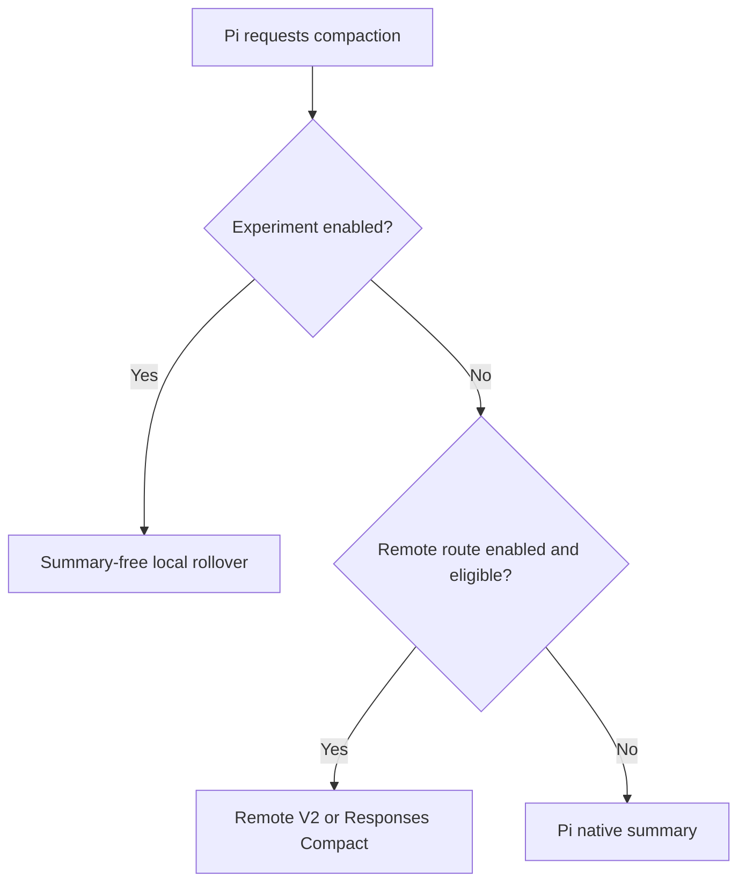
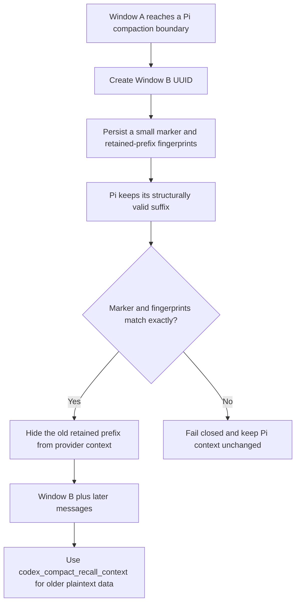
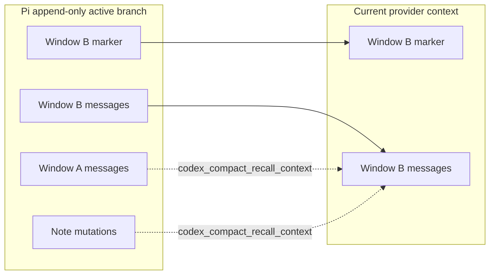

# Experimental context management

> **Experimental:** This feature changes model-visible context and can lose working detail when the
> model does not save or recall it correctly. It is disabled by default. Keep backups of important
> sessions and notes.

Experimental context management is a Pi-native, summary-free rollover strategy inspired by Codex.
Pi keeps the append-only session, while the extension starts a smaller model-visible context window
and lets the model retrieve older plaintext history or branch-local notes with tools.

It is not a port of Codex Core. It does not use Codex private history or notes services, reproduce the
exact Codex token budget, or guarantee same-turn continuation.

## Enable the experiment

Edit the global settings file shown by `/codex-compact`, normally
`~/.pi/agent/pi-codex-compact.json`:

```json
{
  "experimentalContextManagement": true
}
```

You can also turn on **Experimental context management** in `/codex-compact` → **Settings**. Direct
file edits apply on the next `session_start`, including `/reload`, resume, or fork. Menu changes apply
immediately. Pi shows a warning once per active session.

The default is `false`. When enabled, this strategy takes precedence over Remote V2 and unary
Responses Compact. Existing remote settings stay saved and become effective again when the
experiment is disabled.



## Tools

All four tools are active only while the experiment is enabled. Their `codex_compact_` namespace
avoids generic registration collisions. Their definitions intentionally omit system-prompt snippets
and guidelines; one hidden, versioned context contract provides stable model guidance. If another
extension owns any exact tool name, activation fails as a unit, keeps the other extension's tool
active, warns the user, and leaves Pi-native compaction in control.

### `codex_compact_start_new_context`

Request one fresh context window after the current agent run settles:

```json
{
  "reason": "The current window is almost full"
}
```

The tool schedules one rollover and asks Pi to stop after the tool batch. Sibling tool calls may still
finish before the agent becomes idle. Pi stops only when every result in a mixed batch requests
termination. If another model turn runs first, the extension still compacts after settlement. A
successful post-request turn suppresses the duplicate hidden next turn; a turn ending in an error or
output-length cutoff remains eligible for one. If Pi already starts automatic compaction, that
compaction consumes the request; otherwise the extension calls `ctx.compact()` at `agent_settled`.

Successful compaction moves to the new window and sends a hidden next-turn message asking the model
to continue. Failed compaction keeps the old context, reports one warning, and sends a hidden failure
continuation. Either next turn is suppressed when a successful post-request turn already continued
the work. This is a next-turn approximation, not Codex's atomic same-turn transition. Save important
information with `codex_compact_update_notes` before requesting a new context.

### `codex_compact_get_context_remaining`

Inspect the active model's current Pi context estimate without changing state:

```json
{}
```

The result contains the current window ID, context-window size, used tokens, remaining tokens, and
remaining percentage when Pi has an estimate. Token values can be `null` immediately after
compaction and before the next provider response.

### `codex_compact_recall_context`

List, read, or search the active branch's plaintext history or notes:

```json
{
  "source": "history",
  "action": "search",
  "query": "authentication decision"
}
```

```json
{
  "source": "notes",
  "action": "read",
  "id": "project-decisions"
}
```

Accepted sources are `history` and `notes`. Accepted actions are `list`, `read`, and `search`.
`read` requires `id`; `search` requires `query`. Pass a returned `cursor` to continue a bounded list,
search, or long read.

The tool is read-only. It can return model-visible user, assistant, custom-message, and tool-result
content from the active branch, but it excludes extension custom entries, remote checkpoint details,
encrypted checkpoint bytes, and unrelated extension state. It does not detect or redact credentials,
request headers, or other secrets present in model-visible messages or notes.

### `codex_compact_update_notes`

Write or append one branch-local note:

```json
{
  "action": "write",
  "note": "project-decisions",
  "content": "Use OAuth with PKCE."
}
```

```json
{
  "action": "append",
  "note": "project-decisions",
  "content": " Refresh tokens remain server-side."
}
```

`write` replaces the selected note. `append` adds the supplied content exactly, without inserting a
separator. The tool does not read notes; use `codex_compact_recall_context` for that.

## Rollover and storage



The extension preserves Pi's prepared `firstKeptEntryId`, so the session remains structurally valid.
Its `context` hook removes only the exact retained-message prefix recorded in the latest supported
experimental compaction details. A mismatch leaves Pi's context unchanged rather than risking data
loss.

The model-visible compaction marker contains no conversation summary. It identifies the first,
previous, and current window and reminds the model to use the context tools. Enabling, disabling, and
each rollover create intentional prompt-prefix epochs; ordinary turns within an epoch retain the same
ordered tool definitions and existing message prefix.



Window lineage is stored in versioned custom state and compaction details. Notes are stored as
versioned append-only mutations and rebuilt from the active branch, so a fork inherits its ancestor's
notes and then diverges naturally. The extension does not copy raw conversation history into its own
state.

## Limits

Limits are fixed to keep session growth and tool responses bounded:

| Boundary | Limit |
| --- | ---: |
| Note name | 128 characters with no terminal controls |
| One note mutation | 16 KiB UTF-8 |
| Active notes | 64 names and 256 KiB total |
| Recall query | 512 characters |
| Recall search page | 20 matches |
| History search scan | 4,194,304 scan units across indexed characters and visited values per request |
| Recall response | 32 KiB and 1,000 lines |

Long reads and additional list or search matches use cursors. A history search that reaches the scan
limit fails instead of synchronously scanning the rest of an unusually large branch. Malformed or
unsupported persisted versions are ignored individually.

## Compatibility transitions

Enabling the experiment in a session with a remote opaque checkpoint cannot decrypt assistant history
stored only in that checkpoint. The extension warns once, keeps the checkpoint untouched, and can
recall only plaintext Pi entries and future notes. Start the experiment before remote compaction when
complete local recall is important.

Disabling the experiment at idle appends one deterministic hidden deactivation transition and then
removes the four tools. During an active run, the current contract and tools remain available through
settlement; the extension then publishes deactivation before removing the tools. Re-enabling before
settlement cancels that transition and removal. This stops future summary-free rollover without
deleting entries, so existing Pi markers and retained messages remain readable. Re-enable after
settlement to append a new activation transition and regain local recall tools.

Local notes and plaintext history are independent of the selected provider and model. Context usage
always reflects the currently selected model.

## Privacy and security

Pi session files store notes and context metadata as plaintext with the rest of the local session.
Anyone who can read the session can read those notes. `codex_compact_recall_context` sends selected
history or notes to the active model provider as a tool result. Do not store secrets that should not
reach that provider.

Retrieved text is bounded and terminal controls are removed at the result boundary. Extension-owned
provider credentials, request headers, and remote opaque payloads are not part of recallable
checkpoint metadata. Recall does not detect or redact secrets or headers that users, models, or tools
placed in model-visible messages or notes.

## Codex parity limits

A Pi extension cannot reproduce these Codex Core internals:

- Private `alpha/history/v2` and `alpha/notes/v2` services.
- ChatGPT plan checks or Codex-only model capability metadata.
- Exact body-after-prefix token accounting, rollover threshold, and fallback buffer.
- Atomic live-history replacement and continuation in the same model turn.
- Request lineage headers, `comp_hash`, or provider prompt-cache window identity.
- Hidden internal-only tool calls.

Pi remains responsible for thresholds, overflow recovery, `/compact`, session publication, and the
structurally retained suffix. Pi calculates its pre-turn compaction threshold from internal context
before the extension's provider-facing filter, so the retained suffix can still reduce the effective
window budget even when the provider does not receive it. Context-remaining values are estimates and
can reflect this difference. Treat this feature as a portable experimental workflow, not protocol
compatibility with Codex.
