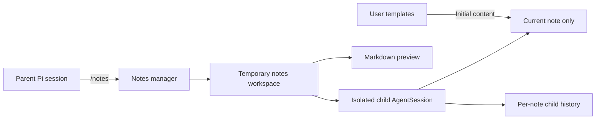

# 📝 Pi Notes — Global Agent-Assisted Markdown Notes

[](https://www.npmjs.com/package/@narumitw/pi-notes) [](https://pi.dev) [](./LICENSE)

`@narumitw/pi-notes` is a Pi extension for browsing and editing user-owned Markdown notes across projects, folders, and worktrees. Each note opens in a focused workspace with an isolated embedded agent and a live Markdown preview.

## ✨ Features

- Keeps every managed item as an equal Markdown note without built-in note types.
- Discovers notes and user-managed templates dynamically under Pi's configured agent directory.
- Shows a responsive split Chat/Preview workspace on wide terminals and tabs on narrow terminals.
- Gives the embedded agent only pathless tools for the currently open note.
- Persists a separate child conversation for each normalized note path without replacing the parent Pi session.
- Creates and updates notes with traversal, symlink, stale-revision, and same-process race checks.

## 📦 Install

Install the extension permanently:

```bash
pi install npm:@narumitw/pi-notes
```

Try it without installing permanently:

```bash
pi -e npm:@narumitw/pi-notes
```

From this repository, install dependencies, build Pi TUI Kit, and load the local package:

```bash
npm install
npm run build --workspace @narumitw/pi-tui-kit
pi --no-extensions --no-skills -e ./packages/pi-notes
```

Pi extensions execute with the same filesystem and process permissions as Pi. Review the package before enabling it; the embedded tool allowlist is a model capability boundary, not an operating-system sandbox.

## 🚀 Quick start

Run Pi in TUI mode, then open the manager:

```text
/notes
```

Choose an existing note or **Create a note…**. New notes can be blank or copy a Markdown template found at `${getAgentDir()}/pi-notes/templates/`; the extension does not seed templates.

## 🧭 How it works



Opening a note temporarily gives terminal input to the notes workspace. Closing it aborts child work, disposes the child session, and returns to the unchanged parent conversation and editor.

All data is below `getAgentDir()`, which honors `PI_CODING_AGENT_DIR`:

```text
${getAgentDir()}/pi-notes/
├── notes/        # Markdown notes
├── templates/    # User-managed initial content
└── sessions/     # Per-note embedded-agent history
```

New managed directories use mode `0700` and newly created notes use `0600` where the platform supports Unix modes. Existing permissions and files are not changed.

## 💬 Commands

`/notes` opens the browse/create manager and accepts no arguments. It requires Pi TUI mode and rejects RPC, print, and JSON modes.

The manager rescans notes and templates when each screen opens. Creating a note copies the selected template exactly once; later template changes do not classify or alter that note.

## Embedded assistant

The child session inherits the parent's selected model and thinking level when that model is available through a separate Pi model runtime. It loads no discovered extensions, skills, prompt templates, themes, context files, shell, or general filesystem tools.

The child receives only these tools:

- `read_current_note` reads the open note and returns its revision.
- `edit_current_note` replaces one unique exact fragment using the latest revision.
- `replace_current_note` replaces the complete open note using the latest revision.

These tools accept no path. Templates affect initial note content only and never become skills, prompt instructions, persistent types, or durable template associations.

## 🔒 Security and privacy

- The managed notes-root path, note content, child prompts, tool results, and relevant child conversation history are sent to the selected model provider when the embedded agent runs.
- Model and credential configuration is read from Pi's configured agent directory. A provider registered only in another extension's in-memory runtime is not inherited.
- Child history remains on disk under `pi-notes/sessions/` until the user removes it.
- Note operations reject absolute paths, traversal, special files, and symlinked managed paths. Same-directory temporary files and atomic publication preserve the previous note when a managed write fails.
- Revision checks detect stale writes, but another process can still change a file immediately around publication; this extension does not provide cross-process locking or an OS sandbox.
- Note paths and content are treated as untrusted terminal text and sanitized only for display; raw Markdown content and valid raw file identities remain unchanged on disk.
- The extension has no delete operation. Removing or disabling the package leaves `getAgentDir()/pi-notes/` untouched.

## 🚧 Limitations

- Notes and templates must be regular `.md` files no larger than 45,000 UTF-8 bytes or 1,800 lines.
- Discovery shows at most 1,000 files, descends at most 16 directories, and reports at most 100 scan issues per pass.
- Each note path supports at most 100 saved child-session files. The visible transcript is bounded to the latest 200 messages and 50,000 characters.
- Renaming a note outside the extension keeps the Markdown usable but starts a new path-associated child conversation.
- Parent-only dynamic providers and runtime-only provider state are unavailable to the child; use a provider reconstructable from Pi's normal model and credential files.
- The first release has no rename, delete, tags, backlinks, full-text index, direct `/notes <path>` route, template language, settings, bundled skill, or template-management UI.
- Cross-process locking, large notes, rich-text editing, attachments, synchronization, and collaborative editing are not supported.

## 🗂️ Package layout

```text
packages/pi-notes/
├── src/           # Extension, storage, child session, manager, and workspace
│   └── index.ts   # Thin Pi entrypoint
├── test/          # Storage, isolation, command, lifecycle, and TUI coverage
├── README.md
└── LICENSE
```

## 🔎 Keywords

pi, pi-extension, notes, markdown, embedded-agent, tui

## 📄 License

[MIT](./LICENSE) © narumiruna
